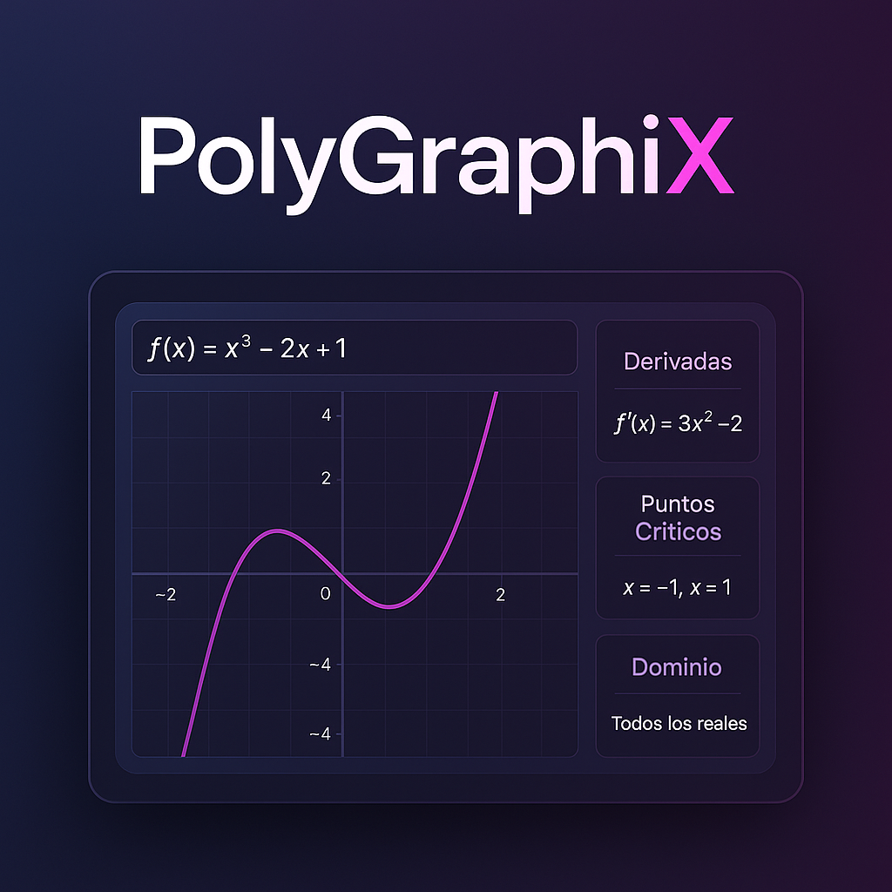

# 📈 PolyGraphiX | Graficador Matemático  
<div align="center">
  
</div>

[](LICENSE)
[](https://menesex.github.io/GraphFuntions/)

Herramienta web para graficar funciones polinómicas y calcular derivadas, puntos críticos y dominio.  

## 🚀 Características  
- **Graficado interactivo**: Visualiza funciones como \( f(x) = x^2 - 2x + 1 \).  
- **Cálculo automático**: Derivadas, puntos críticos y dominio.  
- **Responsive**: Funciona en móviles y desktop.  

## 🔧 Cómo Usarlo  
1. **Online**: Abre la [demo en GitHub Pages]((https://menesex.github.io/PolyGraphiX/)).  
2. **Local**:  
   ```bash
   git clone https://github.com/Menesex/GraphFuntions.git
   cd GraphFuntions
   open index.html
   ```
## PostData
👨🏻‍🎓​ (Proyecto universitario, en 2024-2)

👨🏻‍💻📚Para combinar programación con calculo diferencia, y mejorar mis habilidades en el uso de git/github
 
🥶​ [Tiene muchos errores]

😋El objetivo fue practicar , no hacer un programa perfecto


## 🛠️ Tecnologías  


## 📄 Licencia  
MIT © [Juan Meneses](https://github.com/Menesex)  
